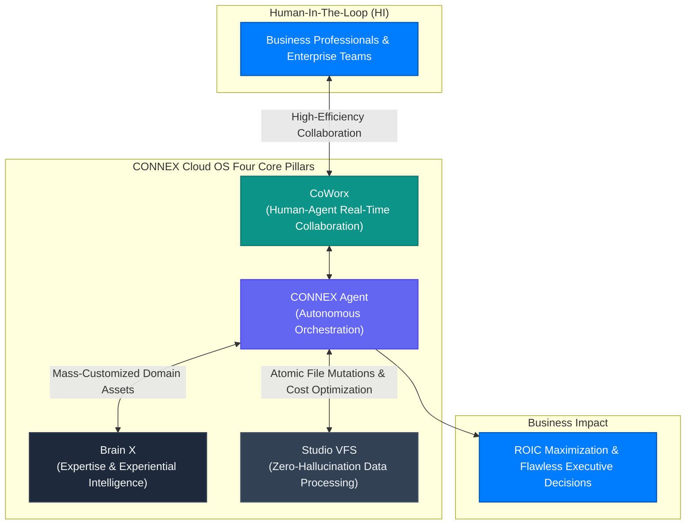

# CONNEX Cloud OS Documentation

```
========================================================================================
   CONNEX CLOUD OS: ENTERPRISE AGENTIC CLOUD WORKSPACE PLATFORM (V31.0)
   NEXUS LAB 126 CONSTITUTIONAL & 88 MASTER ENGINEERING STANDARDS ALIGNED
   FLAGSHIP ECOSYSTEM OF HYBRIDSPHERE | CONNEX BROTHERS CONSULTING GROUP INC.
========================================================================================
```

## I. Constitutional Vision for the AI Era: NEXUS LAB 126 & ROIC Maximization

Amid the exponential surge of artificial intelligence technologies, the vast majority of commercial AI offerings remain superficial **"Simple Wrappers"** around commodity native Large Language Models (LLMs). These shallow wrappers fail critically in mission-critical enterprise environments—exhibiting pervasive hallucinations, catastrophic token cost hemorrhage, and a complete absence of authentic domain expertise.

Under the **HybridSphere** enterprise brand of **Connex Brothers Consulting Group Inc. (CBCG)**, and grounded in the local **NEXUS LAB 126 Constitution for the AI Era**, we engineered an enterprise system designed to empower business professionals in complex problem-solving and executive decision-making. 

The apex achievement of this vision is the **CONNEX Agentic Cloud AI OS Platform**—a symbiotic operating system combining **Human Intelligence (HI)** and **Artificial Intelligence (AI)** to systematically **maximize Return on Invested Capital (ROIC)** through optimized architecture and sovereign orchestration.

---

## II. The Organic Four-Pillar Ecosystem (Core 4 Pillars)

CONNEX is not a monolithic chat box. It is an evolving, symbiotic workspace operating system uniting **four organic core applications: Agent, CoWorx, Brain X, and Studio**.



### 1. CONNEX Agent (Autonomous Enterprise Orchestrator)
- **Autonomous Ecosystem Navigation**: Independently traverses Brain X, Studio VFS, and CoWorx to execute complex multi-turn reasoning workflows.
- **Apex Speed, Cost & Quality**: Governed by an ultra-fast sub-100ms L1 gatekeeper and a sub-LLM query planner that prevents wasteful token bleed, enforced by a deterministic 5-turn budget cap.
- **Tiki-Taka Real-Time Streaming**: Delivers sub-50ms bidirectional streaming over WebSocket/SSE, accompanied by 18 dynamic Recharts analytical visualization layers.

### 2. CoWorx (Human-Agent Symbiotic Collaboration)
- **High-Efficiency Communication**: Facilitates real-time, context-aware collaboration between human team members and specialized autonomous agents within unified conversation threads.
- **Enterprise Channel Governance & RBAC**: Features strict logical segmentation across Public Project, Confidential Executive, and Federated B2B channels, enforced by 7 enterprise roles.
- **1-Click VFS Context Binding**: Seamlessly attaches isolated Virtual File System (VFS) folders and documents directly into chat threads without context distortion.

### 3. Brain X (Qualitative Evolution of LLMs via Proprietary Knowledge Assets)
- **Mass-Customized Problem Solving Beyond Basic RAG**: Injects CBCG’s 30 years of global management consulting acumen and structured domain experience into the semantic reasoning layer, transforming commodity LLMs into specialized decision partners.
- **3-Step Brain Creator Wizard**: Empowers non-technical operators to build custom AI personas by collecting internal policies, agreements, and technical patents into isolated vector spaces.
- **Strict Citation Fidelity**: Enforces mandatory chunk citations (`[ref:filename#section]`) for every factual assertion, eliminating speculative hallucination.

### 4. Studio (Near-Zero Hallucination & Token Cost Minimization via VFS)
- **Deterministic Data Processing**: Prevents raw, uncurated document flooding into LLM context windows; Studio parses, indexes, and serves only verified data chunks through a 3-tier caching hierarchy.
- **7 Core Atomic Mutations**: Enforces atomic transaction safety (`create_folder`, `upload_file`, `delete_item_recursive`, `rename_item`, `move_items`, `move_item`, `clone_file`) with zero-latency synchronization via SSE `VFS_CHANGED` broadcasts.
- **In-Browser Smart Editor & Multimodal Viewers**: Provides an OS-like workspace for viewing and editing code, Markdown, PDF, CSV, and media files directly in the browser.

---

## III. Documentation Center Architecture

This repository (`cbcg-hs-connex-docs`) contains the official Single Source of Truth (SSOT) technical documentation for CONNEX Cloud OS, powered by the Mintlify documentation engine.

### 1. Top Header Navigation (Navbar)
- **Notices**: Operational maintenance schedules and security alerts (`/support/notices`)
- **FAQ**: Comprehensive technical, architectural, and licensing answers (`/support/faq`)
- **Release Notes**: Semantic version change logs (`/support/releases`)
- **Support**: 24/7 dedicated enterprise support desk (`support@connexbrothers.com`)
- **Launch CONNEX**: Direct access to production workspace (`https://connex.hybridsphere.io`)

### 2. Six Primary Navigation Tabs
1. **CONNEX**: AI Ecosystem 2.0 vision, infrastructure topology, and core engine specifications.
2. **Use Cases**: Industry-tailored solutions for Business, Legal & Tax, R&D & Patents, Education, and Healthcare.
3. **Pricing**: Transparent seat-based subscriptions, Pay-As-You-Go metrics, and token capital allocation.
4. **Resources**: Notices, Documentation Center operator guide, and the 24/7 Enterprise Help Desk.
5. **Compliance**: SOC 2 Type II controls ledger, PIPA/CCPA data sovereignty, zero-trust security, and service terms.
6. **Developers**: Public REST/WebSocket APIs, Model Context Protocol (MCP) server specifications, and webhooks.

### 3. Five Persistent Core User Manuals
Rendered persistently in the left sidebar across all documentation tabs:
- **AI Ecosystem 2.0 Manual**: Workspace navigation, launcher controls, session lifecycles, and high-fidelity PDF exports.
- **Agent Manual**: Sub-channel prompt design, 18-visual analytical charts, and multimodal file viewers.
- **CoWorx Manual**: Channel governance, thread context isolation, and real-time notification centers.
- **Brain X Manual**: 3-step brain generation lifecycle, semantic vector indexing, and persona tuning.
- **Studio Manual**: VFS 7 core atomic mutations and in-browser code/markdown editing.

---

## IV. Security Perimeters & Public Governance

1. **Accounts SSO Address Concealment**:
   - Internal SSO authentication URLs and private routing topologies are strictly concealed from public documentation to prevent attack surface enumeration.
   - Authentication integrations are documented exclusively via the single-use UUIDv4 ticket exchange protocol (120-second TTL).
2. **Dedicated Public Documentation Repository**:
   - To preserve internal enterprise repository privacy, this documentation is maintained within an isolated public repository (`cbcg-hs-connex-docs`), completely segregated from private infrastructure and core business codebases.

---

## V. Official Endpoints & Verification Registry

| Service Surface | Canonical Production URL | Description |
| :--- | :--- | :--- |
| **CONNEX Web App** | `https://connex.hybridsphere.io` | Flagship Agentic Cloud Workspace OS production application |
| **Documentation Center** | `https://docs.connex.hybridsphere.io` | Authoritative Mintlify SSOT technical documentation portal |
| **Enterprise Support** | `support@connexbrothers.com` | Global 24/7 technical assistance and SLA dispatch |
| **Public Docs Repository** | `https://github.com/Connex-Brothers-Consulting-Group/cbcg-hs-connex-docs` | Open-source community and developer documentation codebase |

---
*© 2026 Connex Brothers Consulting Group Inc. (CBCG). All rights reserved. NEXUS LAB 126 Constitution Certified.*
