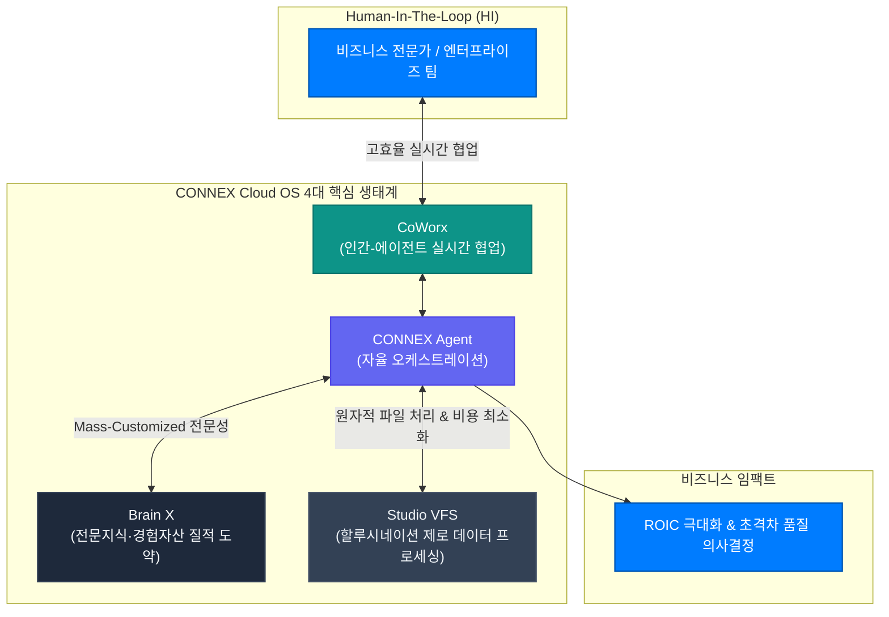

# CONNEX Cloud OS Documentation

```
========================================================================================
   CONNEX CLOUD OS: ENTERPRISE AGENTIC CLOUD WORKSPACE PLATFORM (V31.0)
   NEXUS LAB 126 CONSTITUTIONAL & 88 MASTER ENGINEERING STANDARDS ALIGNED
   FLAGSHIP ECOSYSTEM OF HYBRIDSPHERE | CONNEX BROTHERS CONSULTING GROUP INC.
========================================================================================
```

## I. AI 기술 시대의 헌법적 비전: NEXUS LAB 126 & ROIC 극대화

오늘날 인공지능 기술의 폭발적인 발전 속에서 대부분의 서비스들은 단순한 상용 대형 언어 모델(Native LLM)을 감싸는 **'단순 래퍼(Simple Wrapper)'** 수준에 머무르고 있습니다. 이러한 얕은 래퍼 방식은 실무 비즈니스 환경에서 빈번한 할루시네이션(환각 현상), 막대한 토큰 비용 출혈, 도메인 전문성의 부재라는 치명적인 한계를 노출하고 있습니다.

**Connex Brothers Consulting Group Inc. (CBCG)**의 글로벌 엔터프라이즈 브랜드 **HybridSphere**는 로컬 맥북의 **NEXUS LAB 126 AI 시대 헌법**에 입각하여, 비즈니스 전문가들의 복잡한 문제해결과 최고 수준의 의사결정을 실질적으로 지원하기 위한 플랫폼을 구축했습니다. 

그 궁극의 결실이 바로 인간지능(Human Intelligence, HI)과 인공지능(Artificial Intelligence, AI)이 가장 효율적인 방식으로 협력하여 **투자자본수익률(ROIC, Return on Invested Capital)을 극대화**하는 엔터프라이즈 플래그십, **CONNEX Agentic Cloud AI OS Platform**입니다.

---

## II. 유기적으로 진화하는 4대 플래그십 생태계 (Core 4 Pillars)

CONNEX는 단순한 단일 채팅창이 아닙니다. 비즈니스 전문가의 업무를 자율적·지능적으로 완결 짓는 **4대 유기적 핵심 앱(Agent, CoWorx, Brain X, Studio)**의 공생 체계로 이루어져 있습니다.



### 1. CONNEX Agent (자율 오케스트레이션 엔터프라이즈 에이전트)
- **자율적 생태계 횡단 수행**: 브레인 X와 스튜디오 VFS, 코웍스를 스스로 유기적으로 연계하여 다단계 추론(Multi-turn Reasoning)을 완결합니다.
- **업계 최고 수준의 속도·비용·품질**: 0.1초 SLA의 L1 게이트키퍼와 서브 LLM 쿼리 플래너를 통해 불필요한 토큰 낭비를 원천 차단하고 5-Turn 버짓 캡핑을 적용하여 자본 효율성을 극대화합니다.
- **실시간 티키타카(Tiki-Taka) 스트리밍**: 실시간 WebSocket/SSE 양방향 통신과 18종의 Recharts 동적 시각화 엔진을 통해 결과를 즉각적으로 가시화합니다.

### 2. CoWorx (인간-에이전트 공생 협업 아키텍처)
- **에이전트와 인간의 고효율 커뮤니케이션**: 복수의 전문 에이전트들과 인간 팀원들이 하나의 공간에서 실시간으로 대화하고 태스크를 분담합니다.
- **엄격한 채널 거버넌스 & RBAC**: 공개 프로젝트 채널, 기밀 경영진 채널, B2B 연합 채널로 논리적 분리를 지원하며 엔터프라이즈 7대 역할 기반의 접근 제어를 제공합니다.
- **원클릭 VFS 문맥 바인딩**: 채팅 스레드 내부에서 가상 파일 시스템(VFS)의 파일과 폴더를 즉시 첨부하여 문맥 왜곡 없는 정확한 협업을 구현합니다.

### 3. Brain X (전문지식·경험자산 기반의 LLM 질적 진화)
- **단순 검색(RAG)을 넘어선 Mass-Customized 문제해결**: CBCG의 30년 글로벌 경영 컨설팅 노하우 및 도메인 전문가들의 경험 자산을 구조화된 지식 베이스로 주입하여 상용 LLM의 한계를 뛰어넘습니다.
- **3단계 브레인 생성 마법사(Wizard)**: 기업 고유의 내부 규정, 기밀 계약서, 특허 문서 등을 안전하게 벡터화하여 독자적인 전문 페르소나 브레인을 원클릭으로 구축합니다.
- **엄격한 인용 충실도(Citation Fidelity)**: 모든 답변에 원문 문서 청크 인용(`[ref:filename#section]`)을 강제하여 근거 없는 추론을 원천 배제합니다.

### 4. Studio (할루시네이션 제로 & 토큰 비용 최소화 가상 파일 시스템)
- **할루시네이션 제로에 수렴하는 데이터 프로세싱**: 대규모 문서를 무분별하게 모델 컨텍스트에 쏟아붓지 않고, Studio의 정밀 파싱과 3계층 캐싱을 거쳐 꼭 필요한 데이터 청크만을 에이전트에게 공급합니다.
- **7대 원자적 파일 뮤테이션(Atomic Mutations)**: 폴더 생성부터 파일 배치 이동, 복제까지 완벽한 원자적 트랜잭션을 보장하며, `VFS_CHANGED` SSE 이벤트를 통해 분산 세션 간 0초 지연 동기화를 달성합니다.
- **브라우저 내장 스마트 에디터 & 멀티포맷 뷰어**: 코드, 마크다운, PDF, CSV, 미디어 파일을 OS 환경처럼 원활하게 열람하고 즉시 편집할 수 있습니다.

---

## III. 글로벌 문서센터 아키텍처 (Documentation Center)

본 레포지토리(`cbcg-hs-connex-docs`)는 Mintlify 엔진 기반으로 배포되는 **CONNEX 공식 SSOT 기술 문서센터**의 소스 코드입니다.

### 1. 상단 글로벌 헤더 (Top Header Navigation)
- **공지사항 (Notices)**: 시스템 점검, 보안 패치 및 업데이트 안내 (`/support/notices`)
- **자주 묻는 질문 (FAQ)**: 기술, 라이선스, 보안 관련 질의응답 (`/support/faq`)
- **릴리스 노트 (Release Notes)**: GitFlow 시맨틱 버전 변경 이력 (`/support/releases`)
- **고객지원 (Support Desk)**: 24/7 전용 이메일 창구 (`support@connexbrothers.com`)
- **Launch CONNEX**: 실제 프로덕션 서비스 즉시 접속 (`https://connex.hybridsphere.io`)

### 2. 6대 메인 탭 구조 (Main Navigation Tabs)
1. **CONNEX**: AI 생태계 2.0 비전, 클라우드 OS 아키텍처 및 핵심 엔진 개요
2. **활용사례 (Use Cases)**: 비즈니스/경영, 법률/세무, 학술/R&D, 교육/학습, 헬스케어 5대 산업 솔루션
3. **이용가격 (Pricing)**: 시트 기반 구독 플랜 및 자본 효율적 종량제(Pay-As-You-Go) 요금 정책
4. **리소스 (Resources)**: 공지사항, 문서센터 가이드 및 엔터프라이즈 헬프데스크
5. **컴플라이언스 (Compliance)**: SOC 2 Type II 통제 기준, PIPA/CCPA 데이터 주권, 제로 트러스트 보안 및 이용약관
6. **개발자 가이드 (Developers)**: 공개 REST/WebSocket API 스펙, MCP(Model Context Protocol) 서버 표준 규격서

### 3. 좌측 상시 렌더링 5대 핵심 사용자 매뉴얼 (User Manuals)
- **AI 생태계 2.0 매뉴얼**: 워크스페이스 조작법, 세션 관리 및 리포트 고해상도 출력 가이드
- **에이전트 매뉴얼**: 서브채널 프롬프팅 기법, 18종 분석 차트 및 멀티포맷 뷰어 활용법
- **코웍스 매뉴얼**: 협업 채널 거버넌스, 스레드 문맥 관리 및 실시간 알림 센터
- **브레인 X 매뉴얼**: 3단계 지식 베이스 구축 마법사 및 커스텀 페르소나 튜닝
- **스튜디오 매뉴얼**: VFS 7대 원자적 파일 조작 및 브라우저 인라인 코드 에디터

---

## IV. 보안 경계 및 공개 거버넌스 원칙 (Security Boundaries)

1. **통합인증(Accounts SSO) 보안 은닉**:
   - 내부 인증 백엔드 주소 및 세부 엔드포인트는 외부 보안 침해를 방어하기 위해 공개 문서에서 엄격히 은닉되며, 표준화된 일회용 티켓 교환 규격(Single-Use UUIDv4, 120s TTL)만을 안전하게 기술합니다.
2. **분리된 Public Docs Repository 운영**:
   - 회사의 프라이빗 인프라 및 메인 엔터프라이즈 그룹 레포지토리가 외부에 노출되지 않도록, 본 문서 레포지토리는 독립된 공개 저장소(`cbcg-hs-connex-docs`)로 엄격히 격리되어 운영됩니다.

---

## V. 서비스 및 문서 공식 엔드포인트

| 서비스 영역 | 공식 프로덕션 URL | 역할 및 설명 |
| :--- | :--- | :--- |
| **CONNEX Web App** | `https://connex.hybridsphere.io` | 메인 클라우드 워크스페이스 OS 프로덕션 웹 애플리케이션 |
| **공식 문서센터** | `https://docs.connex.hybridsphere.io` | Mintlify 기반 엔터프라이즈 SSOT 종합 기술 문서 포털 |
| **공식 기술지원** | `support@connexbrothers.com` | 글로벌 엔터프라이즈 고객 전용 24/7 기술 지원 창구 |
| **공개 문서 저장소** | `https://github.com/Connex-Brothers-Consulting-Group/cbcg-hs-connex-docs` | 오픈 커뮤니티 및 개발자를 위한 공개 문서 레포지토리 |

---
*© 2026 Connex Brothers Consulting Group Inc. (CBCG). All rights reserved. NEXUS LAB 126 Constitution Certified.*
