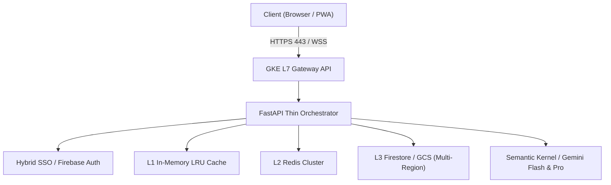

# CONNEX 시스템 아키텍처

CONNEX Cloud OS는 **NEXUS LAB 126 헌법** 및 **88대 마스터 엔지니어링 표준(V31.0)**에 따라 설계된 무결점 엔터프라이즈 아키텍처를 기반으로 동작합니다.

---

## 3대 무결성 공학 철칙

<AccordionGroup>
  <Accordion title="1. 임의의 sleep()을 통한 동기화 영구 금지 (Anti-Fraud)">
    시간차나 에러를 덮기 위해 코드에 `sleep()`을 단 0.1초라도 넣지 않습니다. 모든 동기화는 프로토콜(이벤트, 락, 큐, SWR 캐시)을 통해 결정론적으로 해결합니다.
  </Accordion>
  <Accordion title="2. 핵심 상태 변경의 백그라운드 스레드 방치 금지">
    토큰 발급, 세션 갱신, 커스텀 클레임 권한 등 다음 동작에 영향을 주는 중요 상태는 반드시 `await`로 완료를 확정한 후 다음 단계로 진행합니다.
  </Accordion>
  <Accordion title="3. Mock 테스트 맹신 금지 & E2E 실측 레이턴시 증명">
    단순히 유닛 테스트 Pass에 안주하지 않고, 실제 네트워크 패킷과 런타임 엔드포인트의 Latency를 실측하여 숫자로 증명합니다.
  </Accordion>
</AccordionGroup>
