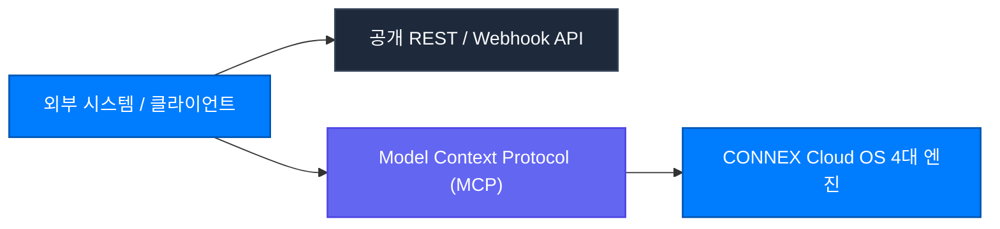

CONNEX는 외부 엔터프라이즈 시스템과 사내 인프라를 지능형 에이전트 생태계와 결합할 수 있는 다양한 공개 인터페이스를 제공합니다.

```mermaid
graph LR
    classDef primary fill:#007CFF,stroke:#0056B3,stroke-width:1.5px,color:#FFFFFF;
    classDef enterprise fill:#1E293B,stroke:#334155,stroke-width:1.5px,color:#F8FAFC;
    classDef ai fill:#6366F1,stroke:#4F46E5,stroke-width:1.5px,color:#FFFFFF;

    Client["외부 시스템 / 클라이언트"]:::primary --> API["공개 REST / Webhook API"]:::enterprise
    Client --> MCP["Model Context Protocol (MCP)"]:::ai
    MCP --> OS["CONNEX Cloud OS 4대 엔진"]:::primary
```
