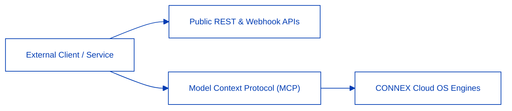

The CONNEX Developer Hub provides the tools and protocols required to embed agentic intelligence and virtual file storage into third-party enterprise applications.

```mermaid
%%{init: {
  'theme': 'base',
  'themeVariables': {
    'background': 'transparent',
    'primaryColor': 'transparent',
    'primaryBorderColor': '#003DB3',
    'primaryTextColor': '#003DB3',
    'secondaryColor': 'transparent',
    'secondaryBorderColor': '#003DB3',
    'secondaryTextColor': '#003DB3',
    'tertiaryColor': 'transparent',
    'tertiaryBorderColor': '#003DB3',
    'tertiaryTextColor': '#003DB3',
    'clusterBkg': 'transparent',
    'clusterBorder': '#003DB3',
    'lineColor': '#003DB3',
    'textColor': '#003DB3',
    'edgeLabelBackground': 'transparent',
    'nodeBorder': '#003DB3',
    'nodeTextColor': '#003DB3',
    'fontFamily': 'Inter, -apple-system, BlinkMacSystemFont, sans-serif',
    'fontSize': '12px'
  }
}}%%
graph LR
Client["External Client / Service"] --> API["Public REST & Webhook APIs"]
    Client --> MCP["Model Context Protocol (MCP)"]
    MCP --> OS["CONNEX Cloud OS Engines"]
```
