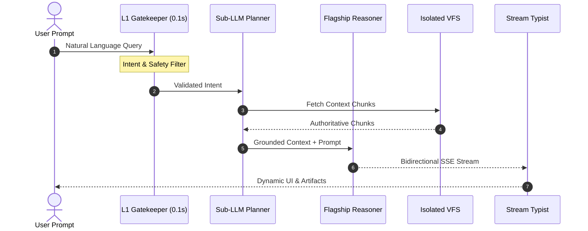

The CONNEX AI Agent is an autonomous enterprise intelligence engine engineered for strategic reasoning, dynamic artifact generation, and multi-turn execution within strict token and security guardrails.

<CardGroup cols={2}>
  <Card title="Multimodal Deep Reasoning" icon="brain">
    Executes multi-step task planning, document synthesis, and domain logic resolution powered by flagship AI models.
  </Card>
  <Card title="Dynamic Artifact Sandboxes" icon="code">
    Generates interactive live components, executable code snippets, Recharts analytical dashboards, and Mermaid diagrams.
  </Card>
  <Card title="Agentic RCAG Grounding" icon="quote">
    In-text chunk citations (`[ref:filename#section]`) anchor all conclusions directly to verified enterprise source documents.
  </Card>
  <Card title="Sub-100ms Query Planner" icon="zap">
    1-turn 1-channel precision targeting minimizes latency and eliminates wasteful multi-turn reasoning loops.
  </Card>
</CardGroup>

---

## Agentic Reasoning Pipeline

The cognitive architecture follows a strict 4-stage pipeline ensuring deterministic business boundary enforcement and capital efficiency.



---

## Technical Specifications

### 1. Token Capital Allocation Guardrails
All autonomous agent reasoning workflows operate within deterministic budgetary limits to eliminate infinite recursion and runaway compute costs.

| Metric / Guardrail | Value | Enforcement Layer | Purpose |
| :--- | :--- | :--- | :--- |
| **Max Turn Budget** | 5 Turns | Native Runtime Guard | Prevents runaway token bleed loops |
| **L1 Gatekeeper SLA** | < 100ms | In-Memory / Flash LLM | Early escapes greetings and out-of-scope traffic |
| **Prompt Max Size** | 70,000 chars | WebSocket Frame Boundary | Prevents 1007 CloseFrame socket disconnects |
| **Citation Fidelity** | 100% Grounded | Post-Processor Filter | Eradicates speculative hallucinations |

### 2. WebSocket Streaming Protocol
Real-time bidirectional streaming delivers token updates directly to the client interface using structured event envelopes.

```typescript
// Example: Subscribing to CONNEX live session stream
const socket = new WebSocket(`wss://connex.cloud/api/v1/agent/live?token=${sessionToken}`);

socket.onmessage = (event) => {
  const envelope = JSON.parse(event.data);
  switch (envelope.type) {
    case 'TEXT_DELTA':
      streamTypist.append(envelope.payload.delta);
      break;
    case 'ARTIFACT_EMIT':
      artifactRegistry.render(envelope.payload.artifact);
      break;
    case 'CITATIONS_RESOLVED':
      citationBadge.update(envelope.payload.sources);
      break;
  }
};
```
