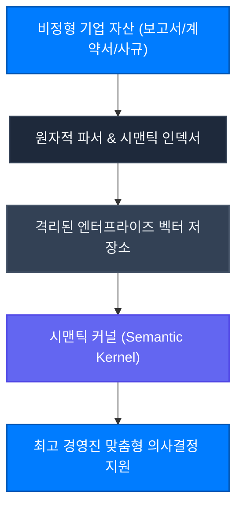

Brain X는 단순한 RAG(검색 증강 생성)를 넘어, 기업의 암묵지와 과거 성공 경험을 구조화하여 대형 언어 모델의 지능을 질적으로 진화시키는 엔터프라이즈 지식 엔진입니다.

---

## Core Capabilities

### 1. 단순 래퍼를 초월한 30년 경영 컨설팅 노하우 주입
일반적인 네이티브 LLM은 최신 비즈니스 맥락과 조직의 내부 역학을 이해하지 못합니다. Brain X는 CBCG의 30년 글로벌 비즈니스 컨설팅 경험칙을 시스템 프롬프트 헌법 및 온톨로지로 주입하여, 단순 요약이 아닌 **실질적 비즈니스 해결책**을 제시합니다.

### 2. 엄격한 데이터 격리 및 주권 보호
각 브레인은 다른 고객사 및 타 부서와 완전히 분리된 전용 인덱스 영역에 저장됩니다. 고객사의 기밀 문서는 어떠한 경우에도 외부 공용 LLM의 학습 데이터로 재사용되지 않습니다.
