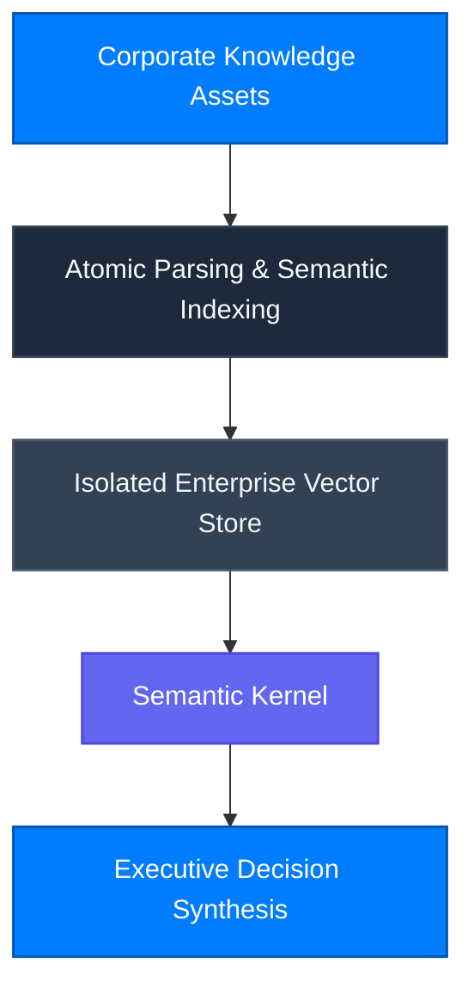

Brain X elevates beyond simple Retrieval-Augmented Generation (RAG) by encoding an enterprise's proprietary institutional knowledge and 30 years of consulting expertise into structured semantic reasoning models.

---

## Core Capabilities

### 1. Transcending Simple Native LLM Wrappers
Commodity foundation models lack domain intuition and corporate historical context. Brain X injects CBCG’s 30 years of global consulting acumen into system ontologies, producing actionable strategic decisions rather than generic summaries.

### 2. Physical Tenancy Isolation
Each enterprise Brain operates in a logically isolated index partition. Customer documents are strictly segregated and are never used to train public foundation models.
