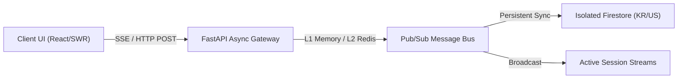

CoWorx is an enterprise-grade collaboration engine providing structured project channels, 1:1 direct messaging, and frictionless virtual file system integration designed for high-density business execution.

<CardGroup cols={2}>
  <Card title="Channel-Based Workspaces" icon="hashtag">
    Public and private channels segmented by project, department, and statutory security boundary.
  </Card>
  <Card title="Direct Messaging (DM)" icon="envelope">
    End-to-end encrypted direct communication for peer-to-peer and executive collaboration.
  </Card>
  <Card title="Instant VFS File Binding" icon="paperclip">
    Inline document attachment from your isolated virtual file system directly within chat threads.
  </Card>
  <Card title="Real-Time SSE Broadcast" icon="bolt">
    Zero-latency typing indicators and instant multi-device read-receipt synchronization.
  </Card>
</CardGroup>

---

## Architectural Workflow

CoWorx integrates real-time messaging with the CONNEX 3-tier caching hierarchy to deliver sub-50ms message delivery across multi-device enterprise sessions.



---

## Core Capabilities

### 1. Channel Segmentation & Access Control
Channels are strictly governed by enterprise RBAC roles. Project workspaces inherit jurisdictional data residency rules automatically based on the organization's statutory `home_region`.

| Channel Type | Access Boundary | Tenancy Isolation | Retention Policy |
| :--- | :--- | :--- | :--- |
| **Public Project** | All verified organization members | Regional Firestore (`accounts-kr` / `accounts-us`) | Configurable (30d - 7yr) |
| **Confidential Executive** | `super_admin`, `founders`, `devops` | Dedicated KMS CMEK Encrypted Collection | Immutable Audit Log |
| **Cross-Organization** | Federated B2B Clients | Multi-Region VPC Peered Bus | Stateless 120s Handshake |

### 2. Instant VFS File Binding
CoWorx allows users to attach virtual documents directly into conversation threads. Attached documents maintain dynamic pointer links, ensuring collaborators always view the authoritative revision without duplicating storage assets.

```typescript
// Example: Attaching a VFS document to a CoWorx thread
const response = await fetch('/api/v1/coworx/messages', {
  method: 'POST',
  headers: {
    'Authorization': `Bearer ${sessionToken}`,
    'Content-Type': 'application/json'
  },
  body: JSON.stringify({
    channelId: 'proj-nexus-126',
    content: 'Please review the updated architecture brief before our executive sync.',
    vfsBindings: ['doc-arch-brief-v3.8.pdf']
  })
});
```

---

## Real-Time Synchronization & Resilience

<AccordionGroup>
  <Accordion title="Zero-Flicker SWR Message Retention">
    CoWorx leverages optimistic UI updates coupled with SWR cache locking (`lastSyncedSessionIdRef`). Background revalidation merges upstream server state seamlessly without unmounting active markdown, KaTeX, or code blocks.
  </Accordion>
  <Accordion title="Wall-Clock Sleep/Wake Heartbeat">
    Connection timers calculate elapsed duration using system wall-clock timestamps (`Date.now() - lastActivity`), eliminating timer drift during OS sleep and ensuring immediate reconnection upon device wake.
  </Accordion>
</AccordionGroup>
