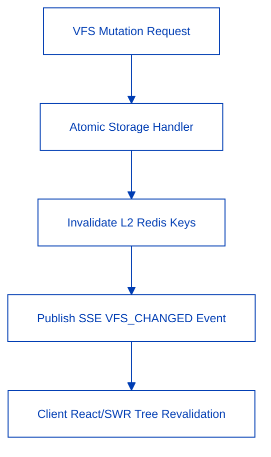

The CONNEX Virtual File System (VFS) provides a cloud-native, hierarchical storage layer engineered for real-time document context injection, multi-region data sovereignty, and sub-millisecond cache invalidation.

<CardGroup cols={2}>
  <Card title="Hierarchical Explorer" icon="folder-tree">
    Nested folder organization with zero frontend expansion overhead and seamless drag-and-drop ingestion.
  </Card>
  <Card title="3-Tier Cache Hierarchy" icon="layers">
    L1 In-Memory and L2 Redis caching intercept duplicate storage I/O, converging repeat query latency to near zero.
  </Card>
  <Card title="Instant SSE Invalidation" icon="rotate-cw">
    All 7 atomic mutation operations immediately broadcast `VFS_CHANGED` to synchronize client trees in real time.
  </Card>
  <Card title="Single-Badge Header Binding" icon="tags">
    Folder and file badges inject authoritative metadata into AI reasoning contexts without token payload explosion.
  </Card>
</CardGroup>

---

## 7 Core Mutation Operations

To ensure strict zero-drift synchronization across distributed sessions, all VFS mutations execute through atomic transactional handlers.

| Operation | Action Trigger | Redis Invalidation | SSE Propagation |
| :--- | :--- | :--- | :--- |
| `create_folder` | New directory creation | Immediate (`user_id`) | `VFS_CHANGED` |
| `upload_file` | Binary / Text document ingestion | Immediate (`user_id`) | `VFS_CHANGED` |
| `delete_item_recursive` | Recursive deletion of items | Immediate (`user_id`) | `VFS_CHANGED` |
| `rename_item` | Title & metadata modification | Immediate (`user_id`) | `VFS_CHANGED` |
| `move_items` | Batch cross-folder relocation | Immediate (`user_id`) | `VFS_CHANGED` |
| `move_item` | Single file relocation | Immediate (`user_id`) | `VFS_CHANGED` |
| `clone_file` | Snapshot duplication | Immediate (`user_id`) | `VFS_CHANGED` |

---

## Context Injection & Single-Badge Governance

<Steps>
  <Step title="1. Select Document or Folder">
    In the explorer interface, click a folder or individual document. When a folder is selected, the input header renders **strictly a single folder badge**.
  </Step>
  <Step title="2. Dynamic Backend Expansion">
    Frontends transmit the root folder identifier directly to the backend. The backend resolves child node pointers dynamically, avoiding payload bloat in client state.
  </Step>
  <Step title="3. Grounded Citation Extraction">
    During agent generation, documents are sliced into vector embeddings and chunked with explicit section anchors (`[ref:filename#section]`).
  </Step>
</Steps>
