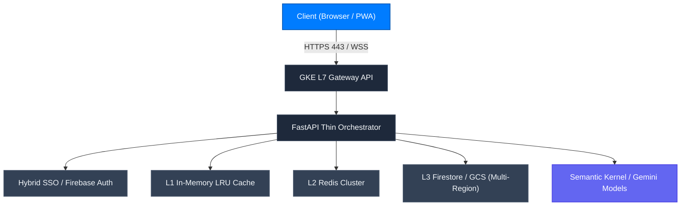

CONNEX Cloud OS is built upon the **NEXUS LAB 126 Constitution** and **88 Master Engineering Standards (V31.0)**, delivering zero-defect reliability across multi-region cloud infrastructures.

---

## Three Anti-Fraud Engineering Standards

<AccordionGroup>
  <Accordion title="1. Permanent Ban on Arbitrary sleep() Synchronization">
    Inserting `sleep()`—even for 0.1s—to mask race conditions or async pipeline lag is categorized as engineering fraud. All temporal delays must be solved deterministically using protocols (events, locks, SWR caching, sync waves).
  </Accordion>
  <Accordion title="2. Prohibition on Abandoning Critical State Mutations in Background Threads">
    State changes affecting downstream authentication (token issuance, custom claims, permissions) must never be neglected in detached threads; transactions must be explicitly awaited before progressing.
  </Accordion>
  <Accordion title="3. Empirical End-to-End Latency Verification">
    Passing unit tests alone is insufficient. Real runtime HTTP packet latencies to local ports (8080, 8081, 3081) must be directly benchmarked and proven with numerical telemetry.
  </Accordion>
</AccordionGroup>
