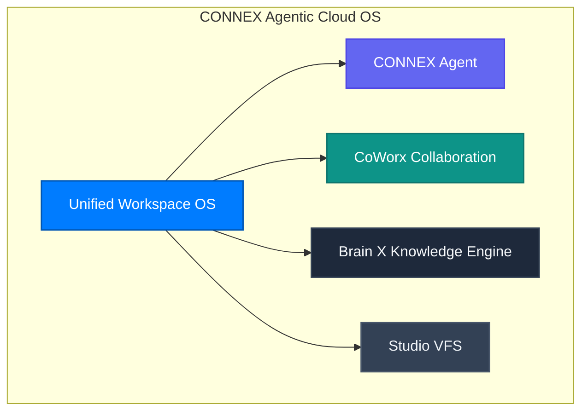

**CONNEX Cloud OS** is an enterprise agentic cloud workspace platform engineered for the symbiotic coexistence of Human Intelligence (HI) and Artificial Intelligence (AI), built to solve complex business challenges while maximizing Return on Invested Capital (ROIC).

---

## Why CONNEX Cloud OS?

### 1. Overcoming Shallow Wrapper Deficiencies
Commodity AI apps simply wrap LLM APIs with thin prompts. CONNEX deploys a multi-tiered architecture with L1 gatekeepers, 3-tier caching hierarchies, and deterministic VFS storage, suppressing hallucination to near-zero.

### 2. Disciplined Capital Allocation (ROIC)
Uncapped agent loops hemorrhage corporate capital. CONNEX enforces deterministic 5-turn budgets, sub-100ms early escapes, and precise sub-channel targeting to maximize output per dollar spent.
