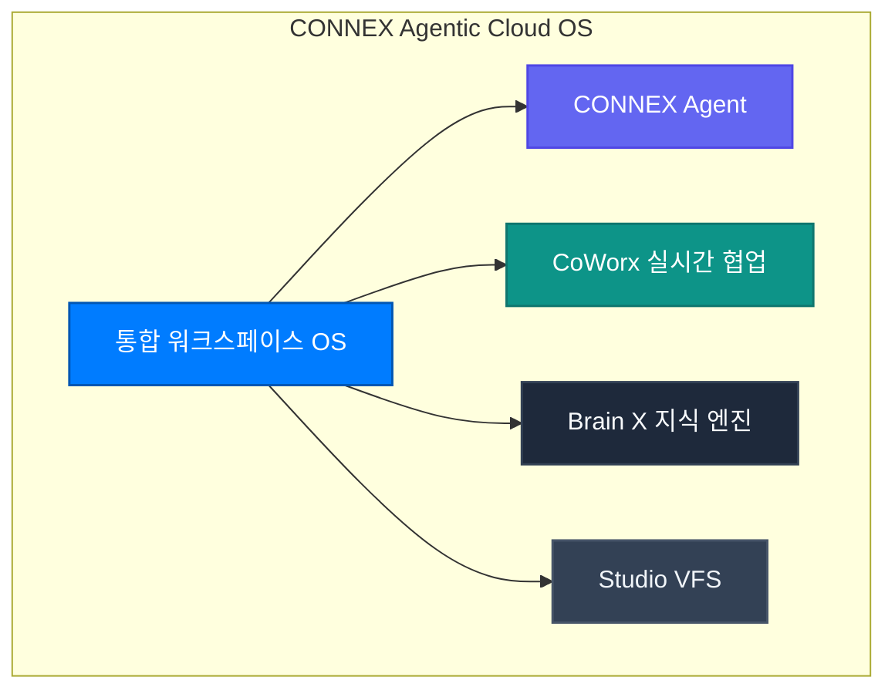

**CONNEX Cloud OS**는 인공지능 기술의 시대에 인간지능(Human Intelligence)과 인공지능(Artificial Intelligence)이 공생하여 비즈니스 전문가들의 복잡한 문제해결과 최적의 의사결정을 지원하는 엔터프라이즈 플래그십 플랫폼입니다.

---

## 왜 CONNEX Cloud OS인가?

### 1. 단순 래퍼 서비스의 한계 극복
시장의 무수한 AI 서비스는 프롬프트 몇 줄로 상용 LLM API를 호출하는 단순 래퍼에 불과합니다. CONNEX는 독자적인 L1 게이트키퍼, 3계층 캐싱 아키텍처, 7대 원자적 VFS를 구축하여 **할루시네이션을 제로에 가깝게 줄이고 속도와 품질을 압도적으로 향상**시켰습니다.

### 2. 투자자본수익률(ROIC) 극대화
무제한적인 토큰 호출로 인한 예산 낭비를 차단하기 위해, 5-Turn 버짓 캡핑과 서브 LLM 플래너를 적용하여 최소의 토큰 비용으로 최상의 결과를 도출합니다.
