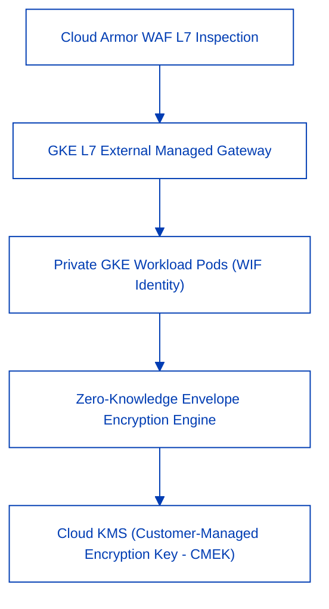
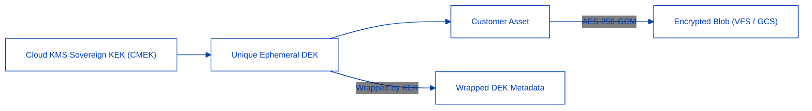
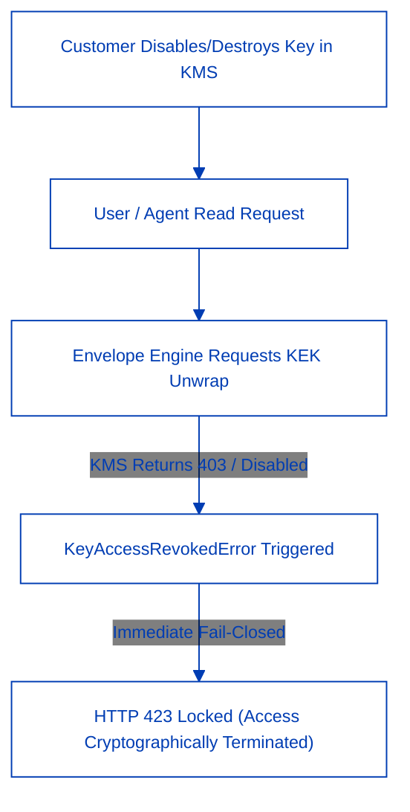

CONNEX Cloud OS is deployed across private Google Kubernetes Engine (GKE) clusters and hardened cloud infrastructures engineered to meet the strictest enterprise security and compliance standards.

---

## Core Security Pillars

1. **Zero Static JSON Keys**: All application pods authenticate using Google Cloud Workload Identity Federation (WIF). Static service account JSON credentials are fundamentally prohibited across all production environments.
2. **L7 Perimeter Defense**: Google Cloud Armor inspects inbound traffic to intercept SQL injection (SQLi), cross-site scripting (XSS), Layer 7 distributed denial-of-service (DDoS) attacks, and automated credential stuffing.
3. **Multi-Region Network Isolation**: Workload nodes utilize private IP addresses exclusively, with public administrative ingress strictly gated through Identity-Aware Proxy (IAP) bastions.

---

## Zero-Knowledge Envelope Encryption

For mission-critical enterprise workloads, CONNEX implements a storage- and framework-agnostic **Zero-Knowledge Envelope Encryption** architecture. This mechanism ensures that neither platform operators nor cloud providers can access customer file contents in plaintext.

### 1. Two-Tier Key Architecture
- **Data Encryption Key (DEK)**: Each document and file version is encrypted using a unique, cryptographically random AES-256-GCM key with a 96-bit per-blob nonce. Nonces are never reused, even when re-encrypting updated file revisions.
- **Key Encryption Key (KEK)**: The ephemeral DEK is wrapped by a master Key Encryption Key hosted securely within a cloud Key Management Service (Google Cloud KMS or AWS KMS). The KEK never leaves the hardware security module (HSM).

### 2. Deployment Models: CMEK vs. PMK
- **Customer-Managed Encryption Key (CMEK)**: The KEK is provisioned and governed entirely inside the enterprise customer's own cloud project. The customer maintains 100% cryptographic authority over key lifecycle, rotation schedules, and IAM grant permissions.
- **Provider-Managed Key (PMK)**: For turnkey deployments, keys are managed inside dedicated, HSM-backed CBCG security perimeters with automated annual rotation.

---

## Instant Cryptographic Kill Switch

The cornerstone of CONNEX data sovereignty is the **Instant Cryptographic Kill Switch**. If an enterprise client detects an internal incident, terminates a contract, or experiences an administrative compliance trigger, they can revoke platform data access instantaneously without relying on provider intervention.

### 1. Zero-Delay Hardware Enforcement
When a customer disables or destroys their KMS key (or revokes the platform's IAM access grant), Cloud KMS immediately denies all subsequent `cryptoKeys.decrypt` requests.
- All downstream read operations immediately raise `KeyAccessRevokedError`, mapped cleanly to **HTTP 423 Locked / Key Revoked**.
- Because key verification occurs directly at the hardware KMS boundary, revocation takes effect across all global regions within milliseconds.

### 2. Request-Scoped Ephemeral Cache (`ContextVar`) & Zero Plaintext Lingering
To maximize performance without compromising the kill switch:
- Plaintext DEKs are cached exclusively within an asynchronous task context (`ContextVar`) bounded to the lifecycle of a single incoming request.
- Once the request terminates, the context is wiped clean (`clear_request_context`). Plaintext DEKs are **never** persisted across requests, stored in Redis, or written to database caches.
- For envelope-encrypted assets, intermediate storage caches (e.g., GCS cache reads) are explicitly bypassed in the Agentic RCAG and VFS ingestion pipelines. This guarantees that disabled keys stop working immediately with zero lingering plaintext in memory.

### 3. Fail-Closed Write Policy
If an enterprise group lacks an active, valid KMS configuration, any attempt to write or mutate assets immediately raises `NoEncryptionContextError` (**HTTP 412 Precondition Failed**). The system strictly refuses to write unencrypted plaintext to disk under any failure scenario.

---

## Verification & Compliance Alignment

| Security Mechanism | Technical Standard | Audit Control |
| :--- | :--- | :--- |
| **Payload Encryption** | AES-256-GCM (96-bit unique nonces) | SOC 2 Type II CC6.1, CC6.3 |
| **Key Custody** | Cloud KMS (FIPS 140-2 Level 3 HSM) | ISO/IEC 27001 A.10.1 |
| **Kill Switch Revocation** | Immediate KMS denial (`KeyAccessRevokedError` → HTTP 423) | PIPA Article 29, GDPR Article 32 |
| **Identity Delegation** | Workload Identity Federation (WIF) | Zero-Trust NIST SP 800-207 |
