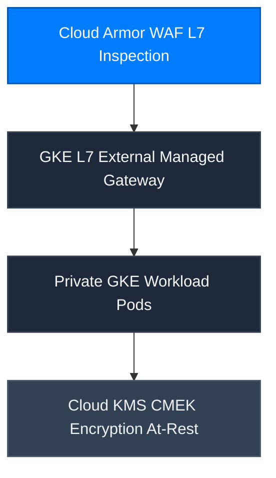

CONNEX Cloud OS is hosted on Google Cloud Platform (GCP) private infrastructures built to the highest enterprise security standards.

---

## Core Security Pillars

1. **Zero Static JSON Keys**: All application pods authenticate via Workload Identity Federation (WIF) with ephemeral tokens.
2. **L7 Perimeter Defense**: Google Cloud Armor inspects inbound traffic to block SQL injection, cross-site scripting (XSS), and DDoS attacks.
3. **CMEK Hardware Protection**: Data at rest is encrypted with Customer-Managed Encryption Keys backed by hardware security modules (HSMs).
