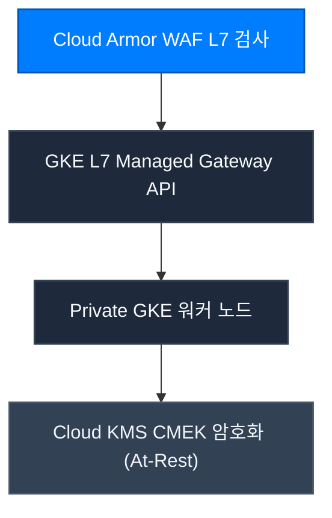

CONNEX Cloud OS는 Google Cloud Platform(GCP) 상의 무결점 보안 인프라를 바탕으로 가동됩니다.

---

## 핵심 보안 원칙

1. **정적 서비스 계정 JSON 키 영구 금지**: 모든 워크로드는 Workload Identity Federation(WIF)을 통해 일시적 토큰으로만 인증합니다.
2. **L7 WAF 방어선**: SQL 인젝션, XSS, 무차별 대입 공격을 인그레스 게이트웨이 전면에서 차단합니다.
3. **CMEK 봉투 암호화**: 저장되는 모든 데이터는 고객 관리 암호화 키를 통해 하드웨어 레벨에서 보호됩니다.
