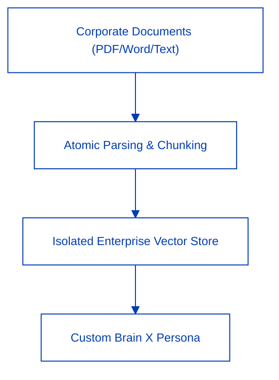

Brain X transforms unstructured corporate data and institutional expertise into specialized, fine-grained reasoning engines that transcend commodity foundation models.



---

## 1. The 3-Step Brain Creator Wizard

Build domain-specific enterprise AI personas in minutes through a guided interface:

<Steps>
  <Step title="Persona Definition & Operational Scope" icon="user-cog">
    - Define name, domain focus (Legal, Accounting, Tax, Engineering), and tone-and-manner constraints.
    - Specify constitutional rules: Must-Dos and Absolute Don'ts.
  </Step>
  <Step title="Knowledge Source Ingestion" icon="file-up">
    - Ingest policy manuals, historical case briefs, and compliance standards via drag-and-drop.
  </Step>
  <Step title="Vector Indexing & Activation" icon="sparkles">
    - The high-throughput embedding engine constructs semantic chunks and publishes the Brain to your organization's registry.
  </Step>
</Steps>

---

## 2. Inviolable Citation Fidelity

Every claim and synthesis generated by Brain X references verified source chunks:
```text
[ref:Corporate_Audit_Standards_2026.pdf#Section_4.3]
```
Assertions lacking evidentiary grounding are rejected by the reasoning engine to maintain strict audit integrity.
