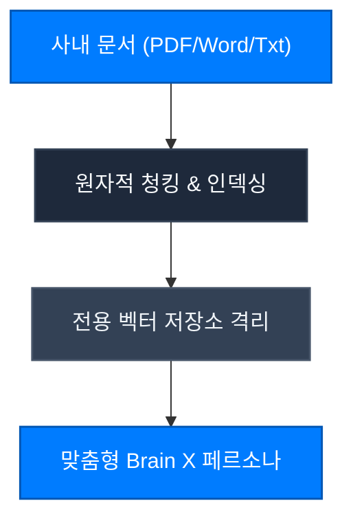

Brain X는 범용 LLM의 한계를 뛰어넘어, 기업 내부의 고유한 전문 지식과 30년 컨설팅 노하우를 인공지능에게 주입하는 엔터프라이즈 지식화 엔진입니다.



---

## 1. 3단계 브레인 생성 마법사 (Brain Creator Wizard)

직관적인 3단계 마법사를 통해 비개발자도 수 분 내에 사내 전용 AI 브레인을 구축할 수 있습니다.

<Steps>
  <Step title="기본 프로필 & 페르소나 정의" icon="user-cog">
    - 브레인의 이름, 전문 도메인(법률, 재무, 엔지니어링 등) 및 톤앤매너를 설정합니다.
    - 필수 준수 규칙(Must-Dos)과 절대 금지 사항(Absolute Don'ts)을 헌법처럼 정의합니다.
  </Step>
  <Step title="지식 베이스 문서 수집" icon="file-up">
    - 사내 규정집, 과거 성공 프로젝트 보고서, 규제 가이드라인 문서를 드래그 앤 드롭으로 업로드합니다.
  </Step>
  <Step title="벡터 인덱싱 및 배포" icon="sparkles">
    - 고속 임베딩 엔진이 문서를 지능형 의미 단위로 청킹하고 전용 벡터 스페이스에 암호화 저장합니다.
  </Step>
</Steps>

---

## 2. 엄격한 인용 충실도 (Citation Fidelity)

Brain X를 기반으로 도출된 모든 답변은 임의의 추정이 아닌 원본 문서의 정확한 섹션을 출처로 명시합니다:
```text
[ref:사내_회계감사규정_2026.pdf#제4조3항]
```
출처가 명확하지 않은 정보는 자동으로 거절되거나 추가 확인을 요청하므로 기업 감사에 완벽히 부합합니다.
