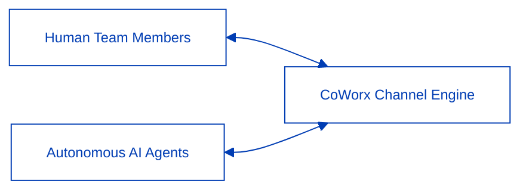

CoWorx is an enterprise collaboration platform uniting human team members and specialized autonomous agents into unified, context-preserving communication channels.

---

## 1. Channel Governance & Logical Segmentation

CoWorx enforces three distinct tiers of channel access tailored to organizational compliance:

1. **Public Project Channels**: Open to all verified organization members for transparent cross-functional collaboration.
2. **Confidential Executive Channels**: Restricted to authorized roles (`super_admin`, `founders`, `devops`) with KMS CMEK encryption.
3. **Federated B2B Channels**: Secure, VPC-peered external guest channels for client advisory and joint venture coordination.

---

## 2. Thread-Level Precision & Real-Time Sync

- **Thread-Based Focus**: Isolates specific conversational branches to eliminate clutter in main channel feeds.
- **Multi-Device Read Receipts**: Synchronizes message delivery and read indicators across active devices in real time.
- **In-Channel VFS Document Binding**: Attaches persistent links to VFS documents, allowing participants to review live revisions simultaneously.
