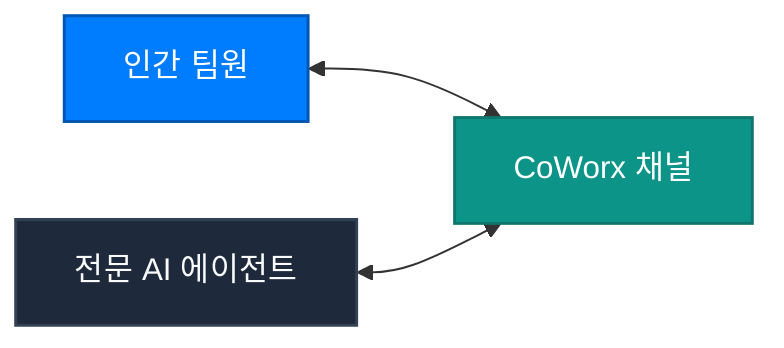

CoWorx는 팀원 간의 인간-인간 협업과 전문 AI 에이전트의 실시간 협동을 하나의 스레드에서 유기적으로 결합한 고효율 엔터프라이즈 커뮤니케이션 플랫폼입니다.

---

## 1. 채널 유형 및 거버넌스

조직의 보안 정책과 프로젝트 성격에 따라 3단계 채널 격리를 지원합니다.

1. **공개 프로젝트 채널 (Public Channels)**:
   - 조직 내 모든 인증된 멤버가 자유롭게 참여하여 프로젝트 현황을 공유합니다.
2. **기밀 경영진 채널 (Confidential Executive)**:
   - `super_admin`, `founders`, `devops` 등 승인된 고위 권한자만 입장 가능한 암호화 채널입니다.
3. **크로스 조직 연합 채널 (Federated B2B)**:
   - 외부 협력사 및 엔터프라이즈 고객과 데이터 유출 없이 안전하게 소통할 수 있는 전용 격리 공간입니다.

---

## 2. 스레드 기반 협업 & 읽음 확인 동기화

- **정밀 스레드(Thread) 대화**: 특정 주제에 대한 토론을 메인 피드와 분리하여 노이즈를 최소화합니다.
- **실시간 읽음 확인(Read Receipts)**: 분산 클라우드 환경에서도 다중 디바이스 간 지연 없이 메시지 수신 상태가 동기화됩니다.
- **인채널 VFS 파일 첨부**: 가상 파일 시스템의 링크가 안전하게 첨부되어, 팀원 누구나 실시간으로 공동 문서를 확인하고 편집할 수 있습니다.
