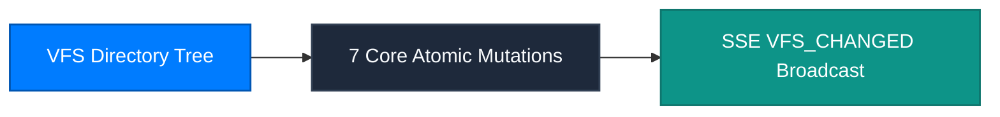

Studio is the dedicated Virtual File System (VFS) workspace for CONNEX Cloud OS, engineered to eliminate model hallucination and minimize intercontinental token transfer costs.

---

## 1. Seven Core Atomic Mutations

Every file operation executes as an atomic transaction, preventing directory corruption during concurrent sessions:

| Mutation | Description | Cache Invalidation | Sync Broadcast |
| :--- | :--- | :--- | :--- |
| `create_folder` | Create directory structure | Immediate (`user_id`) | SSE `VFS_CHANGED` |
| `upload_file` | Ingest binary or text files | Immediate (`user_id`) | SSE `VFS_CHANGED` |
| `delete_item` | Recursive item deletion | Immediate (`user_id`) | SSE `VFS_CHANGED` |
| `rename_item` | Update item title/metadata | Immediate (`user_id`) | SSE `VFS_CHANGED` |
| `move_items` | Batch cross-folder relocation | Immediate (`user_id`) | SSE `VFS_CHANGED` |
| `move_item` | Single file repositioning | Immediate (`user_id`) | SSE `VFS_CHANGED` |
| `clone_file` | Immutable duplicate creation | Immediate (`user_id`) | SSE `VFS_CHANGED` |

---

## 2. In-Browser Smart Editor

Author and modify technical documents directly in your browser without local IDE dependencies:
- **Local Persistence & Crash Recovery**: In-progress edits buffer locally to prevent data loss across connection interruptions.
- **60 FPS Live Markdown Preview**: Renders Markdown structures and KaTeX equations in real time alongside code.
