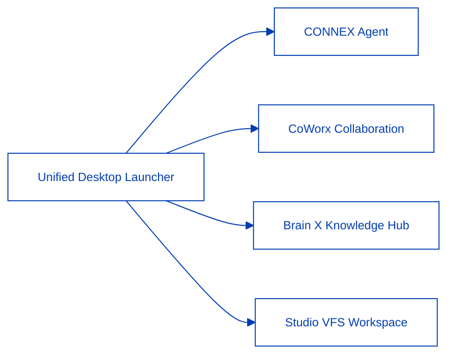

CONNEX Cloud OS is not an arbitrary collection of disjointed tools. It is an **Enterprise Agentic Cloud Workspace Operating System (AI Ecosystem 2.0)** that unifies an organization's mission-critical workflows into a single, cohesive operational surface.

---

## 1. Global Navigation & Desktop Launcher Controls

Navigate seamlessly between the four core flagship applications without context loss using the global header and navigation drawer.

<Steps>
  <Step title="Global Top Header" icon="layout-grid">
    - **Logo Quick Return**: Click the CONNEX logo at any time to return immediately to the main dashboard launcher (`/`).
    - **Notification Center**: Monitor CoWorx channel mentions, task completions, and Brain indexing statuses via real-time badges.
    - **Theme Toggle**: Switch between Solid Navy Mirage (Light Mode) and Frost Dark Glass (Dark Mode) with a single click.
  </Step>
  <Step title="Pinned Left Navigation Drawer" icon="panel-left">
    - Toggle the Pin button to lock the sidebar on wide displays or collapse it to maximize working canvas real estate.
    - One-click access to Use Cases, Pricing, Resources, Compliance, and Developer Hub.
  </Step>
</Steps>

---

## 2. Session Governance (Wall-Clock Session Timer)

In strict adherence to enterprise zero-trust security standards, all user sessions are governed by system-time wall-clock tracking:

- **30-Minute Inactivity Countdown**: The global header timer (`MM:SS`) displays real-time countdown to session expiry.
- **Session Extension Protocol**: A warning state triggers when less than 5 minutes remain; clicking **Extend** replenishes 30 minutes without interrupting active workflows.
- **Optimistic Logout (Sub-10ms Token Zeroization)**: Terminating a session purges all tokens and local session state within 10ms to prevent credential leakage on shared devices.

---

## 3. High-Fidelity Export Viewer (`/print`)

Synthesized agent reports, 18-visual dynamic analytical charts, and VFS documents can be exported with crisp vector quality:

- **Crisp Vector PDF Output**: Retains infinite-resolution SVG charts, formatted Markdown tables, and KaTeX mathematical formulas.
- **Enterprise Watermarking**: Incorporates organizational identity, timestamp, and confidentiality classification headers on export.
