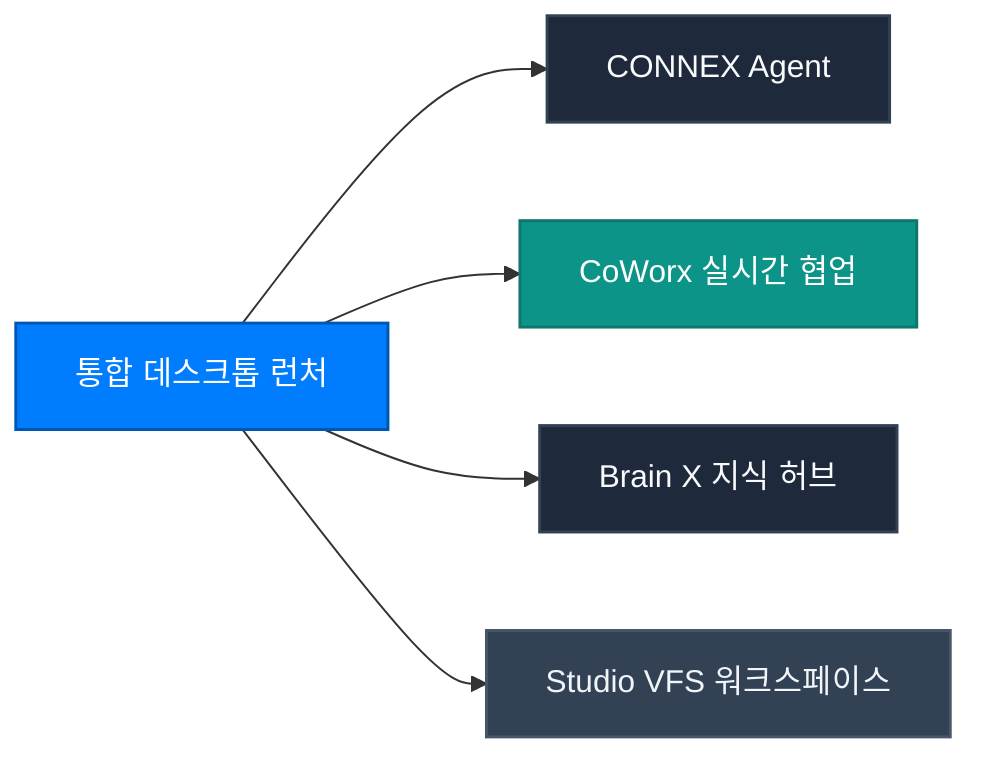

CONNEX Cloud OS는 단편적인 도구들의 나열이 아닌, 비즈니스 전문가의 전사적 업무 흐름을 하나의 통일된 경험으로 통합하는 **차세대 에이전틱 클라우드 작업공간(AI Ecosystem 2.0)**입니다.

---

## 1. 글로벌 네비게이션 & 앱 런처 조작법

CONNEX 상단 헤더 및 좌측 사이드 패널을 통해 4대 플래그십 앱을 전환 지연 없이 탐색할 수 있습니다.

<Steps>
  <Step title="상단 글로벌 헤더" icon="layout-grid">
    - **통합 로고 클릭**: 언제든지 메인 대시보드 및 런처 화면(`/`)으로 즉각 복귀합니다.
    - **실시간 알림 센터**: CoWorx 채널 멘션, 태스크 완료, 브레인 인덱싱 상태를 실시간 배지로 확인합니다.
    - **듀얼 테마 전환**: Solid Navy Mirage(라이트 모드)와 Frost Dark Glass(다크 모드)를 단일 클릭으로 전환합니다.
  </Step>
  <Step title="좌측 고정 사이드 패널" icon="panel-left">
    - 핀(Pin) 고정 토글을 통해 와이드 스크린에서 메뉴를 항상 펼쳐두거나 슬림 모드로 접어 작업 영역을 극대화할 수 있습니다.
    - 활용사례, 이용가격, 리소스, 컴플라이언스 및 개발자 도구에 1-Click으로 접근합니다.
  </Step>
</Steps>

---

## 2. 세션 보안 거버넌스 (Wall-Clock Session Timer)

엔터프라이즈 제로 트러스트 보안 규정에 따라 모든 로그인 세션은 엄격한 시스템 시간 기반으로 보호됩니다.

- **30분 세션 카운트다운**: 상단 헤더의 타이머(`MM:SS`)가 잔여 세션 시간을 실시간 표시합니다.
- **세션 연장 프로토콜**: 잔여 시간 5분 미만 시 경고 색조조가 활성화되며, [연장] 버튼 클릭 시 백엔드 재인증 없이 30분이 즉시 연장됩니다.
- **즉시 로그아웃(낙관적 토큰 제로화)**: 로그아웃 클릭 시 브라우저 내 토큰이 10ms 이내에 영구 파기되어 공용 디바이스에서의 세션 탈취를 방지합니다.

---

## 3. 리포트 & 고해상도 출력 (Export & Print Viewer)

에이전트가 생성한 종합 보고서, 18종 동적 분석 차트 및 VFS 문서는 `/print` 전용 뷰어를 통해 완벽한 인쇄 품질로 추출됩니다.

- **Crisp Vector Rendering**: SVG 차트와 KaTeX 수식, 표(Table) 서식이 깨짐 없이 벡터 해상도로 보존됩니다.
- **Enterprise Watermarking**: 문서 상단 및 하단에 사용자 조직, 일시 및 보안 등급 워터마크가 자동 인쇄됩니다.
