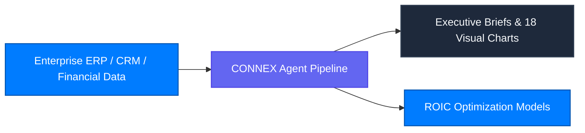

CONNEX Cloud OS breaks down enterprise data silos across ERP, CRM, and financial accounting suites, providing executive leadership with quantitative telemetry and scenario simulations for strategic decision-making.

---

## Key Enterprise Scenarios

1. **Autonomous Executive Reporting**: Synthesizes revenue variance, order backlog, and operating margins with multi-dimensional analytical charts.
2. **M&A Due Diligence & Valuation**: Evaluates target financial statements against macro benchmarks to quantify risk exposures.
3. **Global Supply Chain Bottleneck Forecasting**: Simulates margin impacts under volatile exchange rates and logistics disruptions.
