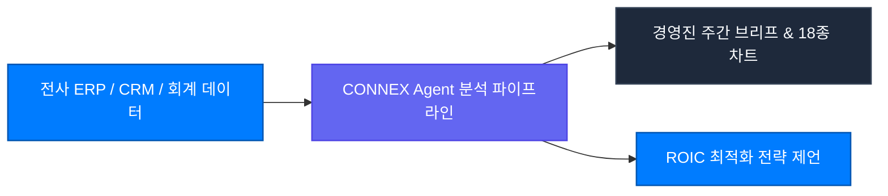

CONNEX Cloud OS는 분산된 전사 데이터 사일로(ERP, CRM, 회계 시스템)를 통합하여, 최고 경영진이 객관적 지표와 시나리오 시뮬레이션을 바탕으로 신속하고 정확한 의사결정을 내릴 수 있도록 지원합니다.

---

## 핵심 활용 시나리오

1. **임원진 주간 경영 리포트 자동 생성**: 매출 추이, 수주 잔고, 영업이익률을 다차원 분석 차트와 함께 즉시 종합합니다.
2. **M&A 및 신규 투자 타당성 검토**: 타깃 기업의 재무제표와 시장 경쟁사 데이터를 비교하여 리스크 팩터를 정량화합니다.
3. **글로벌 공급망(SCM) 병목 예측**: 환율, 원자재 가격 변동에 따른 마진 변화를 실시간 시뮬레이션합니다.
