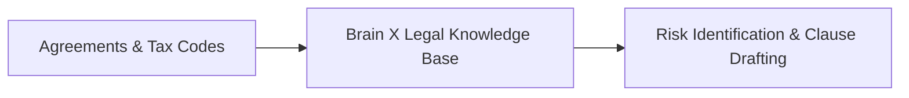

In legal and tax advisory, a single erroneous assumption carries catastrophic financial and legal liability. CONNEX’s citation-grounded architecture guarantees that all conclusions reference statutory precedents and agreement clauses.

---

## Key Enterprise Scenarios

1. **Cross-Border Agreement Auditing**: Flags indemnification exposure, uncapped liability clauses, and unfavorable dispute resolution mechanisms.
2. **Tax Examination Defense Packaging**: Maps transactional ledger items directly to authoritative statutory rulings for audit defense.
